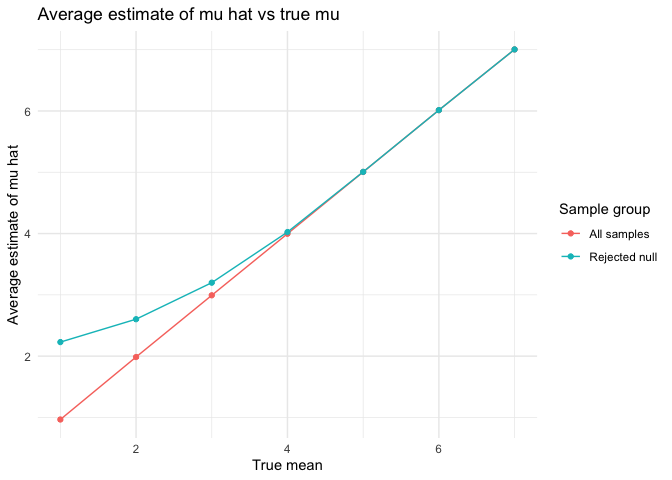
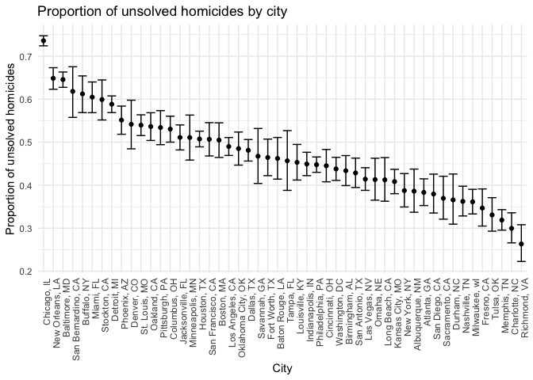

hw5_jl6521
================
Jiayi
2024-11-10

## Problem1

``` r
birthday = function(group_size) {
  day = sample(1:365, group_size, replace = TRUE)
  return(length(day)!= length(unique(day)))
}

group_sizes = 2:50
results = tibble(group_size = group_sizes, prob = NA)
for (i in seq_along(group_sizes)) {
  same_birth = sum(replicate(10000,birthday(group_sizes[i])))
  prob <- same_birth / 10000
  results$prob[i] <- prob
}

ggplot(results, aes(x = group_size, y = prob)) +
  geom_line() +
  geom_point() +
  labs(x = "group size", y = "probability of shared birthday",
       title = "Probability of shared birthday with group size") +
  theme_minimal()
```

<!-- -->
Comment: from the graph, we can see that as group size increases (closer
to 50), the probability of duplicated birthday in the group increases.
Eventually as the group size be closer to 50, the probability is closer
to 1. \## Problem2

``` r
sim_p_true = function(true_mean){
  data = rnorm(30, mean = true_mean, sd = 5)
  test = t.test(data, mu=0)
  result = broom::tidy(test)
  result_df = result %>% 
    select(mu_hat = estimate, p_value = p.value) 
  return (result_df)
}

test_results = expand_grid(
  true_mean = 1:7,
  iter = 1:5000
) %>% 
  mutate(simulation = map(true_mean, sim_p_true)) %>%
  unnest(simulation)

print(test_results)
```

    ## # A tibble: 35,000 × 4
    ##    true_mean  iter  mu_hat p_value
    ##        <int> <int>   <dbl>   <dbl>
    ##  1         1     1  0.179   0.813 
    ##  2         1     2  1.09    0.213 
    ##  3         1     3  1.13    0.255 
    ##  4         1     4  0.723   0.515 
    ##  5         1     5  0.807   0.351 
    ##  6         1     6  1.39    0.117 
    ##  7         1     7  0.346   0.718 
    ##  8         1     8 -0.0225  0.982 
    ##  9         1     9  0.757   0.375 
    ## 10         1    10  1.40    0.0839
    ## # ℹ 34,990 more rows

``` r
power_results = test_results %>%
  group_by(true_mean) %>%
  summarize(power = mean(p_value < 0.05))

ggplot(power_results, aes(x = true_mean, y = power)) +
  geom_line() +
  geom_point() +
  labs(
    title = "Proportion of times the null was rejected ",
    x = "true mean (effect size)",
    y = "power"
  ) +
  theme_minimal()
```

<!-- -->
Comment: From the graph, we can see that the power increases as true
mean increases and eventually be closer to 1.

``` r
average_mu_hat <- test_results %>%
  group_by(true_mean) %>%
  summarize(
    avg_mu_hat_all = mean(mu_hat),
    avg_mu_hat_rejected = mean(mu_hat[p_value < 0.05])
  )

ggplot(average_mu_hat, aes(x = true_mean)) +
  geom_line(aes(y = avg_mu_hat_all, color = "All samples")) +
  geom_point(aes(y = avg_mu_hat_all, color = "All samples")) +
  geom_line(aes(y = avg_mu_hat_rejected, color = "Rejected null")) +
  geom_point(aes(y = avg_mu_hat_rejected, color = "Rejected null")) +
  labs(
    title = "Average estimate of mu hat vs true mu",
    x = "True mean",
    y = "Average estimate of mu hat",
    color = "Sample group"
  ) +
  theme_minimal()
```

<!-- --> Comment: the sample
average of 𝜇̂ across tests for which the null is rejected is slightly
larger to the all samples when the true mean is small. This is because 𝜇̂
values are skewed towards higher estimates when we reject null
hypothesis with larger deviation from 0.

## Problem3

``` r
library(readr)
url = "https://raw.githubusercontent.com/washingtonpost/data-homicides/master/homicide-data.csv"
homicide_data = read_csv(url) %>% 
  janitor::clean_names() %>% 
  mutate(
    city_state = str_c(city,", ",state)
  ) 
```

    ## Rows: 52179 Columns: 12
    ## ── Column specification ────────────────────────────────────────────────────────
    ## Delimiter: ","
    ## chr (9): uid, victim_last, victim_first, victim_race, victim_age, victim_sex...
    ## dbl (3): reported_date, lat, lon
    ## 
    ## ℹ Use `spec()` to retrieve the full column specification for this data.
    ## ℹ Specify the column types or set `show_col_types = FALSE` to quiet this message.

``` r
summary_homocide = homicide_data %>% 
  group_by(city_state) %>% 
  summarize(
    total_homicides = n(),
    unsolved_homicides = sum(disposition %in% c("Closed without arrest", "Open/No arrest",na.rm = TRUE)))
```

Comment: The dataset provides *r nrows(homicide_data)* criminal
homicides over the past decade in 50 of the largest American cities.
There are report dates, demographic information of victim name, race,
age, and sex, location information of city, state, and latitude and
longitude, as well as the whether an arrest was made.

``` r
baltimore_data <- summary_homocide %>%
  filter(city_state == "Baltimore, MD") 


prop_test_result = prop.test(
  x = baltimore_data %>% pull(unsolved_homicides),
  n = baltimore_data %>% pull(total_homicides)) %>% 
  broom::tidy()

result_prop_df = prop_test_result %>% 
    select(estimate, conf.low, conf.high)

print(result_prop_df)
```

    ## # A tibble: 1 × 3
    ##   estimate conf.low conf.high
    ##      <dbl>    <dbl>     <dbl>
    ## 1    0.646    0.628     0.663

``` r
prop_test_function <- function(unsolved, total) {
  prop_test_result <- prop.test(x = unsolved, n = total) %>% 
    broom::tidy() %>% 
    select(estimate, conf.low, conf.high) %>% 
  return(prop_test_result)
}

prop_test_results <- summary_homocide %>%
  mutate(
    test_summary = map2(unsolved_homicides, total_homicides, prop_test_function)
  ) %>%
  unnest(test_summary) %>%
  rename(proportion = estimate)
```

    ## Warning: There was 1 warning in `mutate()`.
    ## ℹ In argument: `test_summary = map2(unsolved_homicides, total_homicides,
    ##   prop_test_function)`.
    ## Caused by warning in `prop.test()`:
    ## ! Chi-squared approximation may be incorrect

``` r
print(prop_test_results)
```

    ## # A tibble: 51 × 6
    ##    city_state   total_homicides unsolved_homicides proportion conf.low conf.high
    ##    <chr>                  <int>              <int>      <dbl>    <dbl>     <dbl>
    ##  1 Albuquerque…             378                146      0.386    0.337     0.438
    ##  2 Atlanta, GA              973                373      0.383    0.353     0.415
    ##  3 Baltimore, …            2827               1825      0.646    0.628     0.663
    ##  4 Baton Rouge…             424                196      0.462    0.414     0.511
    ##  5 Birmingham,…             800                347      0.434    0.399     0.469
    ##  6 Boston, MA               614                310      0.505    0.465     0.545
    ##  7 Buffalo, NY              521                319      0.612    0.569     0.654
    ##  8 Charlotte, …             687                206      0.300    0.266     0.336
    ##  9 Chicago, IL             5535               4073      0.736    0.724     0.747
    ## 10 Cincinnati,…             694                309      0.445    0.408     0.483
    ## # ℹ 41 more rows

``` r
ggplot(prop_test_results, aes(x = reorder(city_state, -proportion), y = proportion)) +
  geom_point() +
  geom_errorbar(aes(ymin = conf.low, ymax = conf.high), width = 0.3) +
  coord_flip() +
  labs(
    title = "Proportion of unsolved homicides by city",
    x = "City",
    y = "Proportion of unsolved homicides"
  ) +
  theme_minimal()
```

<!-- -->
