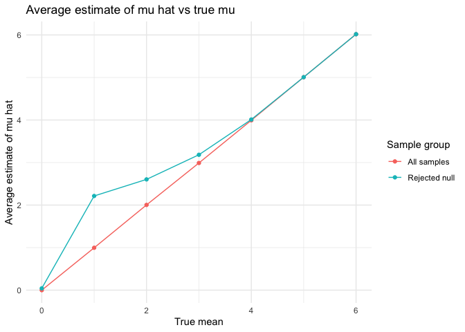

hw5_jl6521
================
Jiayi
2024-11-10

## Problem1

``` r
birthday = function(group_size) {
  day = sample(1:365, group_size, replace = TRUE)
  return(length(day)!= length(unique(day)))
}

group_sizes = 2:50
results = tibble(group_size = group_sizes, prob = NA)
for (i in seq_along(group_sizes)) {
  same_birth = sum(replicate(10000,birthday(group_sizes[i])))
  prob <- same_birth / 10000
  results$prob[i] <- prob
}

ggplot(results, aes(x = group_size, y = prob)) +
  geom_line() +
  geom_point() +
  labs(x = "group size", y = "probability of shared birthday",
       title = "Probability of shared birthday with group size") +
  theme_minimal()
```

<!-- -->
Comment: from the graph, we can see that as group size increases (closer
to 50), the probability of duplicated birthday in the group increases.
Eventually as the group size be closer to 50, the probability is closer
to 1.

## Problem2

``` r
set.seed(1)
sim_p_true = function(true_mean){
  data = rnorm(30, mean = true_mean, sd = 5)
  test = t.test(data, mu=0)
  result = broom::tidy(test)
  result_df = result %>% 
    dplyr::select(mu_hat = estimate, p_value = p.value) 
  return (result_df)
}

test_results = expand_grid(
  true_mean = 0:6,
  iter = 1:5000
) %>% 
  mutate(simulation = map(true_mean, sim_p_true)) %>%
  unnest(simulation) %>% 
  mutate(indicator = as.numeric(p_value < 0.05))
```

``` r
power_results = test_results %>%
  group_by(true_mean) %>%
  summarize(power = mean(p_value < 0.05))

ggplot(power_results, aes(x = true_mean, y = power)) +
  geom_line() +
  geom_point() +
  labs(
    title = "Proportion of times the null was rejected ",
    x = "true mean (effect size)",
    y = "power"
  ) +
  theme_minimal()
```

<!-- -->
Comment: From the graph, we can see that the power increases as true
mean increases and eventually be closer to 1. As the effect size
increases, the power would increase.

``` r
average_mu_hat <- test_results %>%
  group_by(true_mean) %>%
  summarize(
    avg_mu_hat_all = mean(mu_hat),
    avg_mu_hat_rejected = mean(mu_hat[p_value < 0.05])
  )

ggplot(average_mu_hat, aes(x = true_mean)) +
  geom_line(aes(y = avg_mu_hat_all, color = "All samples")) +
  geom_point(aes(y = avg_mu_hat_all, color = "All samples")) +
  geom_line(aes(y = avg_mu_hat_rejected, color = "Rejected null")) +
  geom_point(aes(y = avg_mu_hat_rejected, color = "Rejected null")) +
  labs(
    title = "Average estimate of mu hat vs true mu",
    x = "True mean",
    y = "Average estimate of mu hat",
    color = "Sample group"
  ) +
  theme_minimal()
```

<!-- --> Comment: the gragh
shows the average estimate of μ across all samples and for samples where
the null hypothesis was rejected. Sample average of 𝜇̂ across tests for
which the null is rejected is larger to the all samples for smaller
effect size. This is because 𝜇̂ values are skewed towards higher
estimates when we reject null hypothesis. Some tests might be rejected
purely by chance. As mu increases, the power improves, and bias would be
reduced, and the difference becomes smaller.

## Problem 3

``` r
library(readr)
url = "https://raw.githubusercontent.com/washingtonpost/data-homicides/master/homicide-data.csv"
homicide_data = read_csv(url) %>% 
  janitor::clean_names() %>% 
  mutate(
    city_state = str_c(city,", ",state)
  ) %>% 
  filter(city_state !="Tulsa, AL")
```

    ## Rows: 52179 Columns: 12
    ## ── Column specification ────────────────────────────────────────────────────────
    ## Delimiter: ","
    ## chr (9): uid, victim_last, victim_first, victim_race, victim_age, victim_sex...
    ## dbl (3): reported_date, lat, lon
    ## 
    ## ℹ Use `spec()` to retrieve the full column specification for this data.
    ## ℹ Specify the column types or set `show_col_types = FALSE` to quiet this message.

``` r
summary_homocide = homicide_data %>% 
  group_by(city_state) %>% 
  summarize(
    total_homicides = n(),
    unsolved_homicides = sum(disposition %in% c("Closed without arrest", "Open/No arrest",na.rm = TRUE)))%>% 
  filter(city_state !="Tulsa, AL")

summary_homocide |> knitr::kable()
```

| city_state         | total_homicides | unsolved_homicides |
|:-------------------|----------------:|-------------------:|
| Albuquerque, NM    |             378 |                146 |
| Atlanta, GA        |             973 |                373 |
| Baltimore, MD      |            2827 |               1825 |
| Baton Rouge, LA    |             424 |                196 |
| Birmingham, AL     |             800 |                347 |
| Boston, MA         |             614 |                310 |
| Buffalo, NY        |             521 |                319 |
| Charlotte, NC      |             687 |                206 |
| Chicago, IL        |            5535 |               4073 |
| Cincinnati, OH     |             694 |                309 |
| Columbus, OH       |            1084 |                575 |
| Dallas, TX         |            1567 |                754 |
| Denver, CO         |             312 |                169 |
| Detroit, MI        |            2519 |               1482 |
| Durham, NC         |             276 |                101 |
| Fort Worth, TX     |             549 |                255 |
| Fresno, CA         |             487 |                169 |
| Houston, TX        |            2942 |               1493 |
| Indianapolis, IN   |            1322 |                594 |
| Jacksonville, FL   |            1168 |                597 |
| Kansas City, MO    |            1190 |                486 |
| Las Vegas, NV      |            1381 |                572 |
| Long Beach, CA     |             378 |                156 |
| Los Angeles, CA    |            2257 |               1106 |
| Louisville, KY     |             576 |                261 |
| Memphis, TN        |            1514 |                483 |
| Miami, FL          |             744 |                450 |
| Milwaukee, wI      |            1115 |                403 |
| Minneapolis, MN    |             366 |                187 |
| Nashville, TN      |             767 |                278 |
| New Orleans, LA    |            1434 |                930 |
| New York, NY       |             627 |                243 |
| Oakland, CA        |             947 |                508 |
| Oklahoma City, OK  |             672 |                326 |
| Omaha, NE          |             409 |                169 |
| Philadelphia, PA   |            3037 |               1360 |
| Phoenix, AZ        |             914 |                504 |
| Pittsburgh, PA     |             631 |                337 |
| Richmond, VA       |             429 |                113 |
| Sacramento, CA     |             376 |                139 |
| San Antonio, TX    |             833 |                357 |
| San Bernardino, CA |             275 |                170 |
| San Diego, CA      |             461 |                175 |
| San Francisco, CA  |             663 |                336 |
| Savannah, GA       |             246 |                115 |
| St. Louis, MO      |            1677 |                905 |
| Stockton, CA       |             444 |                266 |
| Tampa, FL          |             208 |                 95 |
| Tulsa, OK          |             583 |                193 |
| Washington, DC     |            1345 |                589 |

Comment: The dataset provides *r nrows(homicide_data)* criminal
homicides over the past decade in 50 of the largest American cities.
There are report dates, demographic information of victim name, race,
age, and sex, location information of city, state, and latitude and
longitude, as well as the whether an arrest was made. Tulsa, AL is
deleted because of the data entry error.

``` r
baltimore_data <- summary_homocide %>%
  filter(city_state == "Baltimore, MD") 


prop_test_result = prop.test(
  x = baltimore_data %>% pull(unsolved_homicides),
  n = baltimore_data %>% pull(total_homicides)) %>% 
  broom::tidy()

#result_prop_df = prop_test_result %>% 
 #   select(estimate, conf.low, conf.high)

prop_test_result %>% knitr::kable()
```

|  estimate | statistic | p.value | parameter |  conf.low | conf.high | method                                               | alternative |
|----------:|----------:|--------:|----------:|----------:|----------:|:-----------------------------------------------------|:------------|
| 0.6455607 |   239.011 |       0 |         1 | 0.6275625 | 0.6631599 | 1-sample proportions test with continuity correction | two.sided   |

``` r
prop_test_function <- function(unsolved, total) {
  prop_test_result <- prop.test(x = unsolved, n = total) %>% 
    broom::tidy() %>% 
    select(estimate, conf.low, conf.high) %>% 
  return(prop_test_result)
}

prop_test_results <- summary_homocide %>%
  mutate(
    test_summary = map2(unsolved_homicides, total_homicides, prop_test_function)
  ) %>%
  unnest(test_summary) %>%
  rename(proportion = estimate)

prop_test_results %>% knitr::kable()
```

| city_state         | total_homicides | unsolved_homicides | proportion |  conf.low | conf.high |
|:-------------------|----------------:|-------------------:|-----------:|----------:|----------:|
| Albuquerque, NM    |             378 |                146 |  0.3862434 | 0.3372604 | 0.4375766 |
| Atlanta, GA        |             973 |                373 |  0.3833505 | 0.3528119 | 0.4148219 |
| Baltimore, MD      |            2827 |               1825 |  0.6455607 | 0.6275625 | 0.6631599 |
| Baton Rouge, LA    |             424 |                196 |  0.4622642 | 0.4141987 | 0.5110240 |
| Birmingham, AL     |             800 |                347 |  0.4337500 | 0.3991889 | 0.4689557 |
| Boston, MA         |             614 |                310 |  0.5048860 | 0.4646219 | 0.5450881 |
| Buffalo, NY        |             521 |                319 |  0.6122841 | 0.5687990 | 0.6540879 |
| Charlotte, NC      |             687 |                206 |  0.2998544 | 0.2660820 | 0.3358999 |
| Chicago, IL        |            5535 |               4073 |  0.7358627 | 0.7239959 | 0.7473998 |
| Cincinnati, OH     |             694 |                309 |  0.4452450 | 0.4079606 | 0.4831439 |
| Columbus, OH       |            1084 |                575 |  0.5304428 | 0.5002167 | 0.5604506 |
| Dallas, TX         |            1567 |                754 |  0.4811742 | 0.4561942 | 0.5062475 |
| Denver, CO         |             312 |                169 |  0.5416667 | 0.4846098 | 0.5976807 |
| Detroit, MI        |            2519 |               1482 |  0.5883287 | 0.5687903 | 0.6075953 |
| Durham, NC         |             276 |                101 |  0.3659420 | 0.3095874 | 0.4260936 |
| Fort Worth, TX     |             549 |                255 |  0.4644809 | 0.4222542 | 0.5072119 |
| Fresno, CA         |             487 |                169 |  0.3470226 | 0.3051013 | 0.3913963 |
| Houston, TX        |            2942 |               1493 |  0.5074779 | 0.4892447 | 0.5256914 |
| Indianapolis, IN   |            1322 |                594 |  0.4493192 | 0.4223156 | 0.4766207 |
| Jacksonville, FL   |            1168 |                597 |  0.5111301 | 0.4820460 | 0.5401402 |
| Kansas City, MO    |            1190 |                486 |  0.4084034 | 0.3803996 | 0.4370054 |
| Las Vegas, NV      |            1381 |                572 |  0.4141926 | 0.3881284 | 0.4407395 |
| Long Beach, CA     |             378 |                156 |  0.4126984 | 0.3629026 | 0.4642973 |
| Los Angeles, CA    |            2257 |               1106 |  0.4900310 | 0.4692208 | 0.5108754 |
| Louisville, KY     |             576 |                261 |  0.4531250 | 0.4120609 | 0.4948235 |
| Memphis, TN        |            1514 |                483 |  0.3190225 | 0.2957047 | 0.3432691 |
| Miami, FL          |             744 |                450 |  0.6048387 | 0.5685783 | 0.6400015 |
| Milwaukee, wI      |            1115 |                403 |  0.3614350 | 0.3333172 | 0.3905194 |
| Minneapolis, MN    |             366 |                187 |  0.5109290 | 0.4585150 | 0.5631099 |
| Nashville, TN      |             767 |                278 |  0.3624511 | 0.3285592 | 0.3977401 |
| New Orleans, LA    |            1434 |                930 |  0.6485356 | 0.6231048 | 0.6731615 |
| New York, NY       |             627 |                243 |  0.3875598 | 0.3494421 | 0.4270755 |
| Oakland, CA        |             947 |                508 |  0.5364308 | 0.5040588 | 0.5685037 |
| Oklahoma City, OK  |             672 |                326 |  0.4851190 | 0.4467861 | 0.5236245 |
| Omaha, NE          |             409 |                169 |  0.4132029 | 0.3653146 | 0.4627477 |
| Philadelphia, PA   |            3037 |               1360 |  0.4478103 | 0.4300380 | 0.4657157 |
| Phoenix, AZ        |             914 |                504 |  0.5514223 | 0.5184825 | 0.5839244 |
| Pittsburgh, PA     |             631 |                337 |  0.5340729 | 0.4942706 | 0.5734545 |
| Richmond, VA       |             429 |                113 |  0.2634033 | 0.2228571 | 0.3082658 |
| Sacramento, CA     |             376 |                139 |  0.3696809 | 0.3211559 | 0.4209131 |
| San Antonio, TX    |             833 |                357 |  0.4285714 | 0.3947772 | 0.4630331 |
| San Bernardino, CA |             275 |                170 |  0.6181818 | 0.5576628 | 0.6753422 |
| San Diego, CA      |             461 |                175 |  0.3796095 | 0.3354259 | 0.4258315 |
| San Francisco, CA  |             663 |                336 |  0.5067873 | 0.4680516 | 0.5454433 |
| Savannah, GA       |             246 |                115 |  0.4674797 | 0.4041252 | 0.5318665 |
| St. Louis, MO      |            1677 |                905 |  0.5396541 | 0.5154369 | 0.5636879 |
| Stockton, CA       |             444 |                266 |  0.5990991 | 0.5517145 | 0.6447418 |
| Tampa, FL          |             208 |                 95 |  0.4567308 | 0.3881009 | 0.5269851 |
| Tulsa, OK          |             583 |                193 |  0.3310463 | 0.2932349 | 0.3711192 |
| Washington, DC     |            1345 |                589 |  0.4379182 | 0.4112495 | 0.4649455 |

``` r
ggplot(prop_test_results, aes(x = reorder(city_state, -proportion), y = proportion)) +
  geom_point() +
  geom_errorbar(aes(ymin = conf.low, ymax = conf.high)) +
  labs(
    title = "Proportion of unsolved homicides by city",
    x = "City",
    y = "Proportion of unsolved homicides"
  ) +
  theme_minimal()+
  theme(axis.text.x = element_text(angle = 90, hjust = 1))
```

<!-- -->
